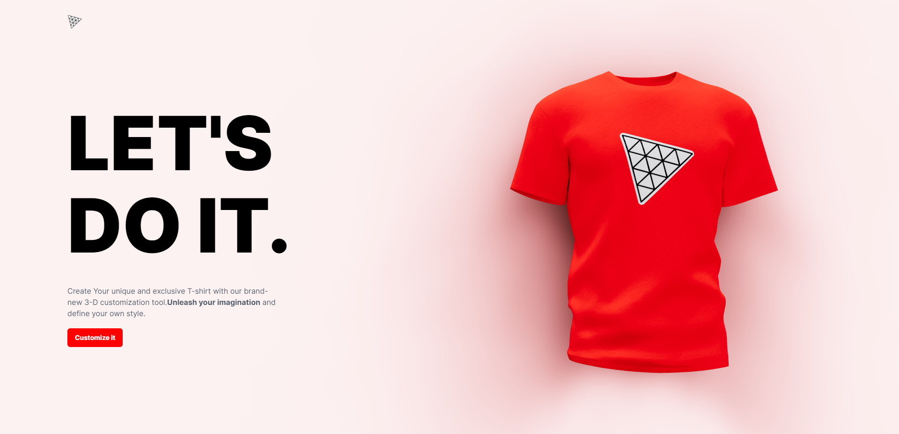
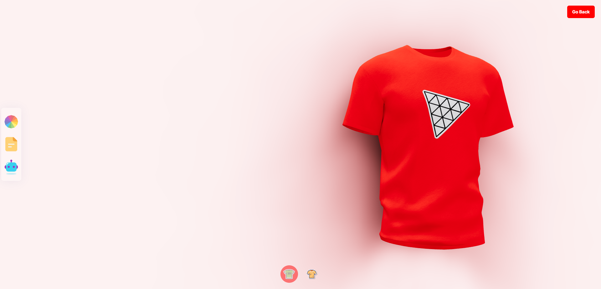
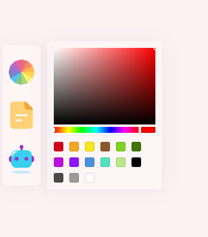
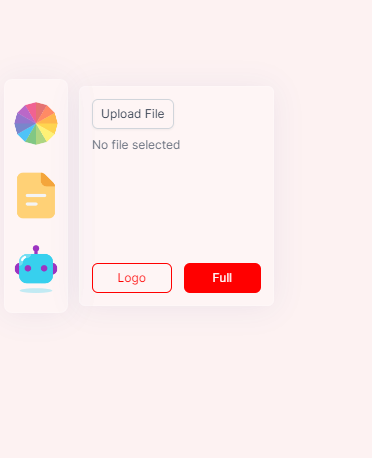
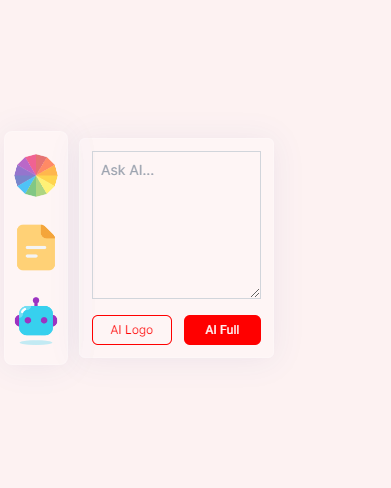

# T-Shirt Design App

### [Webpage LINK](https://tshirt-designer.onrender.com/)

✨✨✨This is a website with fully custumized 3-D T-Shirt modal to custumize our own T-Shirt.

### ----------------------------------------------------

🔥🔥This Project is inspired from @javascriptmastery youtube channel.

##### [LINK](https://www.youtube.com/watch?v=ZqEa8fTxypQ)

### ----------------------------------------------------

### Custumizable Elements On 3-D Tshirt:-

- Color of T-shirt
- Logo on T-shirt
- Texture of T-shirt

### Bundler used

- Vite-React

### Pakages used in Frontend

- @react-three/drei (Lighting and environment)
- @react-three/fiber(Canvas ,useFramer)
- framer-motion
- maath
- three.js(3-D modal)
- valtio(For maintaing State)

## Project Images

### Homr Section

### Customizer Section

### Customizer Elements

#### ColorPicker

Changes the color of T-Shirt model

#### ColorPicker

To pick image from computer to use as Logo or Texture of T-Shirt model

#### ColorPicker

Asks AI to generate Logo or Texture of T-Shirt model

### ------------------------------------------------------

## Backend

- Node

### Packages Used

- Express
- cors
- OpenAi
- mongoose
- cloudinary
- dotenv
- nodemon

### ----------------------------------------------------

## App Hosted

- render.com
